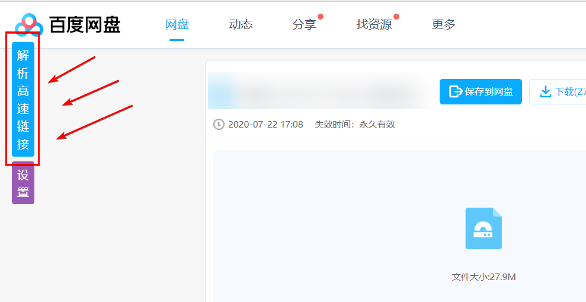

### 介绍

一个油猴脚本，功能：

1、解析浏览器页面，匹配所有可能的网盘链接及其可能对应的密码保存到缓存中，在需要填写密码的页面进行填写。

2、提供淘宝、天猫商品的历史价格查询以及隐藏优惠券查询。

3、提供视频的解析网站一键跳转服务。

基于 webpack 打包的单 js 应用

其他功能：

1、通过一个解析网站解析网盘高速下载链接，故提供一个跳转按钮：

2、历史价格、隐藏优惠券：

### 相关网站

1、优惠券系统：[https://shop.misiai.com/](https://shop.misiai.com/)

2、解析网站：[http://pan.naifei.cc/](http://pan.naifei.cc/)

### 协议

[MIT](./LICENSE)
